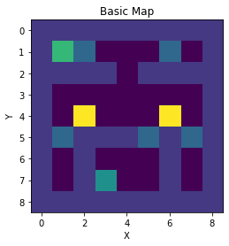
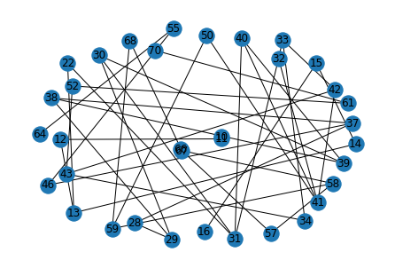
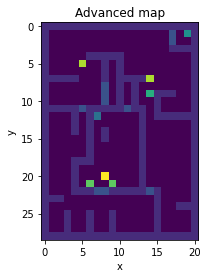

# DRL-coursework

Deep Reinforcement Learning Coursework

## Basic task

### The story version

Fired from a Solar Federation Space Force Infiltrator, our intrepid Space Marine Commando robot exits its boarding pod in a random place in the Custodian warship. Its mission is to cripple the ship's reactor before its crew are revived from stasis by planting a timed explosive on it. Its survival is optional, after it has completed its mission the robot can escape back to where a shuttle has cut a hole into the ship to retrieve it. But if the robot is destroyed, well we can always build more robots.

### The code version

Here we are using Q-learning to get an agent to solve the above map. The Light Green point is the ultimate goal and exit point. The dark green point is the point of highest reward, but can only be claimed once. The yellow points are traps which will cause damage. The blue points are doors which don't do anything. The light purple points are walls (for simplicity they are excluded from the below graph). The dark purple points are empty space which the agent can walk over.

This graph shows which points on the map are available from the others.

## Advanced task

Here our agent lands on a bigger spaceship and has to take out the reactor and then escape, while dodging traps and enemies.

### No improvements (basic DQN)

https://user-images.githubusercontent.com/51207735/163679340-029113d2-af5d-44ce-894b-a0d72ac33ccb.mp4

### DoubleQ

https://user-images.githubusercontent.com/51207735/163679354-6f7a564c-38bd-4028-9f4f-c91c764ea84e.mp4

### Prioritised Replay

https://user-images.githubusercontent.com/51207735/163679367-81e7e035-6ddb-4088-b153-89f3922f3e6e.mp4

### Both

https://user-images.githubusercontent.com/51207735/163679376-f94f9e36-6a75-4ea2-8869-eb4f01bbe5a6.mp4

## installs
run apt-get update first
xvfb
python-opengl
ffmpeg